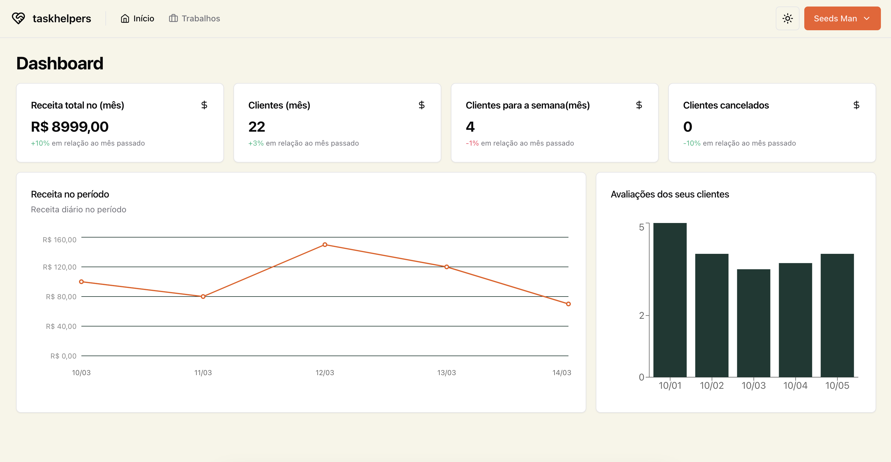

<h1 align="center">TaskHelpers a plataforma que você buscava🤝</h1>

Projeto realizado como desafio prático para o curso de Desenvolvimento FullStack na PUCRS. Consiste em uma interface desenvolvida com React e um projeto construído com Node.js para criar uma aplicação prática e funcional. Utiliza diversos conhecimentos adquiridos ao longo do curso.

## Descrição do projeto

Esta é a interface web de um sistema de gerenciamento de clientes, onde o cliente pode cadastrar seu serviço e, com base em sua localização, preço e outros fatores, selecionar prestadores de serviço que atendam às suas necessidades. Haverá dois tipos principais de usuários: os "taskers" (que contratam os serviços) e os "helpers" (que fornecem os serviços contratados). Com base nisso, a plataforma fará um "match" para conectar o cliente ao prestador de serviço mais adequado.

## Project UI 🎨

- [Figma - Taskhelpers](https://www.figma.com/file/Ed96JNLRj7ggCIXpaeezPo/TaskHelpers?type=design&node-id=0-1&mode=design&t=oxE2VtNQVYudjXGA-0)

## Demonstração das interfaces:




## Funcionalidades do projeto

- Light/dark
- Usuário podem se cadastrar
- Obter métricas dos serviços
- Filtrar e pesquisar por clientes
- Cadastrar e atualizar o perfil

## Tecnologias 🖥️

- [React](https://react.dev/)
- [Tailwind](https://tailwindcss.com/)
- [Typescript](https://www.typescriptlang.org/)
- [React Router](https://reactrouter.com/en/main)
- [React Hook Form](https://react-hook-form.com/)
- [Zod](https://zod.dev/)

## Como usar

<!-- Example: -->

Pra clonar o repositório vocês precisar ter instalado o [Git](https://git-scm.com) com [Node.js](https://nodejs.org/en/download/) (já vêm com o [npm](http://npmjs.com)) instalados no seu computados. Pela a sua linha de comando:

```bash
# Clone this repository
$ git clone https://github.com/Artur-Ceschin/taskhelper-web.git

npm i
npm run dev
# or
yarn
yarn dev
# or
pnpm i
pnpm run dev
```

## License

[MIT](https://choosealicense.com/licenses/mit/)
